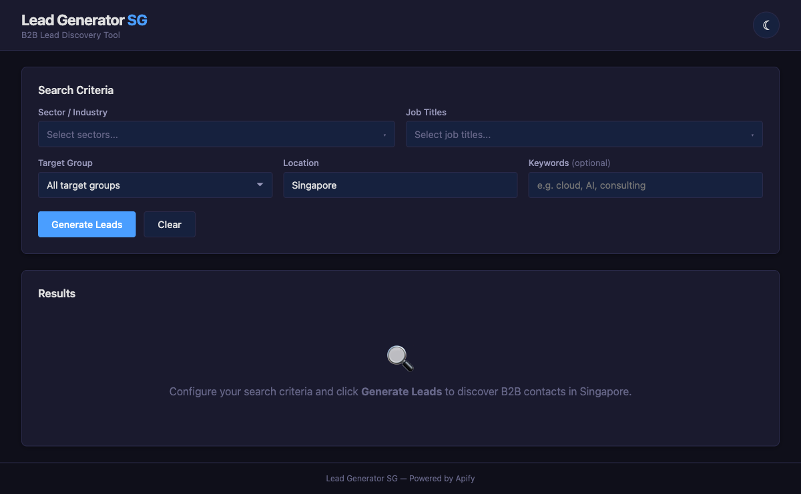
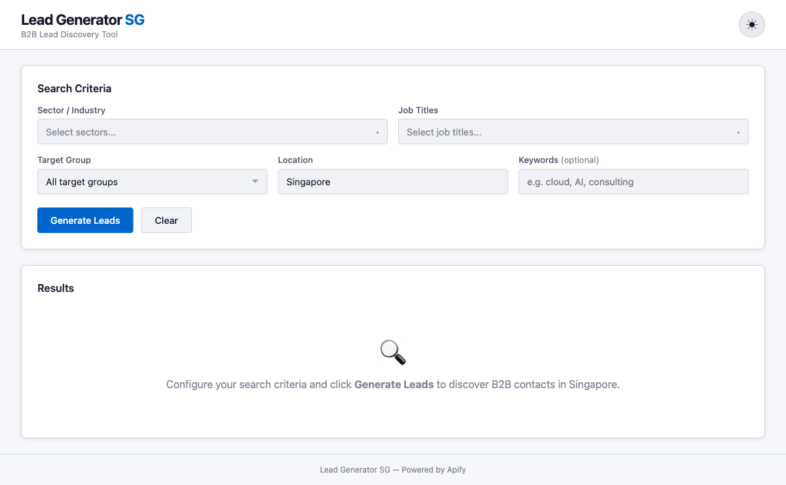

# Agentic AI Applications with Claude Code (TGS-2025052468)

This repository contains the hands-on course activities and sample project for the WSQ course **Agentic AI Applications with Claude Code** (Course Code: TGS-2025052468).

**Register for the course:** [https://www.tertiarycourses.com.sg/wsq-agentic-ai-applications-with-claude-code.html](https://www.tertiarycourses.com.sg/wsq-agentic-ai-applications-with-claude-code.html)

## Live Demos

- **Lead Generation:** [tertiarycourses.github.io/TGS-2025052468-Claude-Code/lead-generation/](https://tertiarycourses.github.io/TGS-2025052468-Claude-Code/lead-generation/)
- **Bride Booking:** [tertiarycourses.github.io/TGS-2025052468-Claude-Code/bride-booking/](https://tertiarycourses.github.io/TGS-2025052468-Claude-Code/bride-booking/)

## Course Activities

The step-by-step learner activities are documented in [course-activities.md](course-activities.md), covering:

- **Topic 1: Claude Code Fundamentals** — Installation, VS Code setup, project structure, building a Lead Generator web app, CLAUDE.md, memory management, GitHub setup
- **Topic 2: Tools and Commands** — Custom slash commands, MCP tools (Apify & Playwright), API token configuration
- **Topic 3: Skills and Agents** — Community skills, frontend design skill, custom agents (UX/UI reviewer, code reviewer), Git worktrees, GitHub Actions, hooks

## Sample Project: Lead Generator SG

A B2B lead discovery tool for the Singapore market built during the course. Search for business contacts by sector, job title, target group, and location — powered by Apify's Google Maps Scraper.

### Screenshots

#### Dark Mode


#### Light Mode


### Features

- **Multi-criteria Search** — Filter by 17 Singapore industries, 13 B2B job titles, 5 target groups
- **Apify Integration** — Scrapes real business data from Google Maps via Apify API
- **Sortable Results Table** — Click column headers to sort, with pagination (25/page)
- **CSV Export** — Download leads as a timestamped CSV file
- **Dark/Light Theme** — Toggle between themes, preference saved to localStorage
- **Responsive Design** — Works on desktop and mobile

### Tech Stack

- HTML5 / CSS3 / Vanilla JavaScript
- [Apify API](https://apify.com) (Google Maps Scraper)
- CSS Custom Properties for theming
- No frameworks or build tools required

## Getting Started

### 1. Clone the repository

```bash
git clone https://github.com/alfredang/TGS-2025052468-Claude-Code.git
cd TGS-2025052468-Claude-Code
```

### 2. Start a local server

```bash
npx serve
```

### 3. Open in browser

Navigate to http://localhost:3000

### 4. Enter your Apify token

When you click **Generate Leads** for the first time, you'll be prompted to enter your Apify API token. Get yours at [console.apify.com](https://console.apify.com) under **Settings > API & Integrations**.

Your token is stored in `localStorage` and never committed to the repo.

## Project Structure

```
course-activities.md — Step-by-step learner activities
index.html           — Main page with search form and results table
style.css            — Dark/light theme styling via CSS custom properties
data.js              — Singapore sectors, job titles, target groups
app.js               — Application logic, Apify API calls, table rendering
export.js            — CSV export utility
```

## License

MIT
